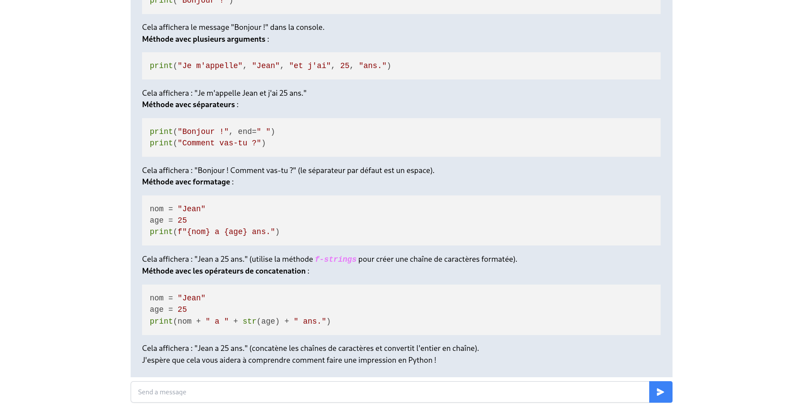

# Chat ollama with llama3 model


## Stack
- python3.12.3
- JS 
- HTML 
- Tailwindcss

I use poetry to manage python package. 

Package python need: 
- Flask
- ollama


JS libraries: 
- highlight
- showdown

## Getting started
- clone this repo
```git clone https://github.com/Aissam-salman/chatOllama.git```
- go to chatOllama directory
```cd chatOllama```
- install poetry 

**linux, macOS**
```curl -sSL https://install.python-poetry.org | python3 -```

**windows** 
```(Invoke-WebRequest -Uri https://install.python-poetry.org -UseBasicParsing).Content | py - ```

- install package 
```poetry install```

- run server flask 
```python app.py```
